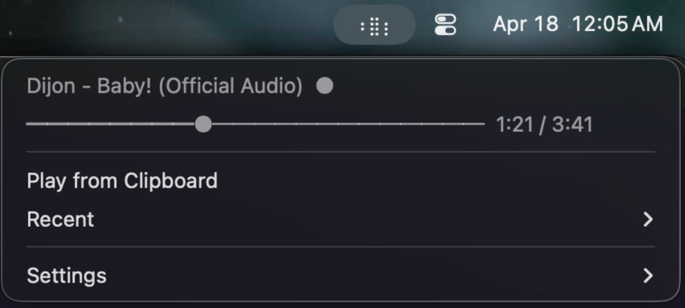

# yt-bar

**Frictionless YouTube listening on macOS.** 



- lives in the menu bar
- plays tracks from the clipboard
- imports local audio files for playback
- supports media keys
- caches tracks locally for offline playback

## Install

Requirements:
- macOS
- Python `3.12+`
- `uv`
- `yt-dlp` on `PATH`
- `ffmpeg` on `PATH`

Install the Python env:

```bash
uv sync
```

Run it once directly:

```bash
.venv/bin/python yt_bar.py
```

Alternate package entrypoint:

```bash
uv run python -m yt_bar
```

Or install it as a LaunchAgent so it starts cleanly in your logged-in GUI session:

```bash
./install.sh
```

Remove the LaunchAgent later with:

```bash
./uninstall.sh
```

## Development

Run the standard checks:

```bash
uv run pytest -q
uv run ruff check .
uv run ruff format --check .
.venv/bin/python -m compileall yt_bar.py yt_bar
```

While iterating, prefer focused checks for changed files, such as:

```bash
uv run pytest tests/test_smoke.py -q
uv run ruff check yt_bar/app.py
uv run ruff format --check yt_bar/app.py
```

Automated tests cover fake-backed menu rendering/action dispatch, clipboard intake routing, MediaPlayer remote commands, and Now Playing payload updates. Real menu-bar interaction, media-key delivery, pasteboard behavior, native audio output/device handoff, external `yt-dlp` / `ffmpeg`, and live YouTube URLs remain manual or integration testing.

## Usage

Core:
- Copy a YouTube video or playlist URL and use `Play from Clipboard`.
- Use `Play Local File...` to import a local audio file into the app library and play it.
- Or drag a local audio file onto the menu bar item to import and play it.
- Playback starts immediately, and the track is cached locally while you listen.
- `Recent` lets you replay cached YouTube tracks and imported local files. Hold `Option` to remove an entry or `Option` + `Shift` to rename its label.
- `Songs` in the full menu lets you jump to any track in the currently loaded multi-track playlist and continue forward from there.
- Use F7 / F8 / F9 media keys to play/pause and skip forward or back.

Additional:
- The badge next to the song title shows playback source: `◌` means streaming, `●` means local cache.
- `Settings` lets you toggle `Compact Menu`, change skip interval seconds, and change the recent-list limit.
- Cached YouTube media, imported local files, the recent list, and settings are stored under `songs/`.
- Single videos and imported local files stay directly under `songs/` as readable `.opus` filenames with stable hash suffixes. Playlist imports create a readable folder under `songs/` and store the playlist tracks inside it; existing files stay in place.

## Visualizer Algorithm
The visualizer is a tiny stereometer rendered as 3 braille characters in the menu bar. 

It reads a short stereo snapshot from the `AVAudioEngine` mixer tap, converts left/right into mid/side, and plots the strongest samples into a fading 4x6 dot grid. 

In practice this means:
- narrow or mono material forms a tighter center trace
- wide stereo material splays outward
- phasey or side-heavy material pushes farther toward the edges
